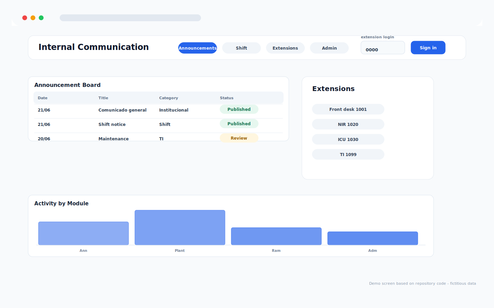
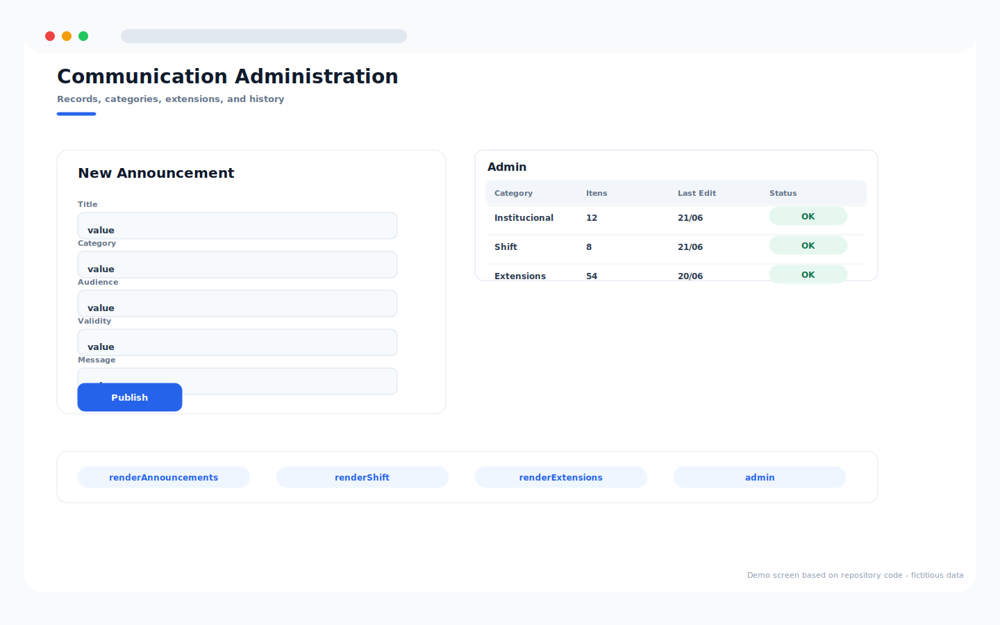

# Internal Communication Platform

Repository: `internal-communication-platform`

## Overview

Internal communication portal for announcements, shift notices, extensions, categories, administration, and publication history.

## Main Capabilities

- Top navigation for announcements, shift notices, extensions, and admin.
- Announcement board with date, title, category, and publication status.
- Extension directory and staff-access login field.
- Administrative form for publishing and maintaining content.

## Operating Flow

1. Staff members access the portal and review current announcements.
2. The shift and extension tabs support daily operational communication.
3. Admins publish new announcements and maintain categories.
4. The history view keeps communication traceable.

## Visual System Guide

> The screens below are documentation mockups based on the components, labels, colors, and workflows found in this repository. All displayed data is fictitious and does not represent real patients, staff members, or institutions.

### Internal Communication - portal

### Internal Communication - admin

## Data Privacy

The repository documentation and guide images use fictitious sample data only.

## Technologies

- JavaScript
- HTML/CSS
- Google Apps Script
- Google Sheets

## Status

Completed
